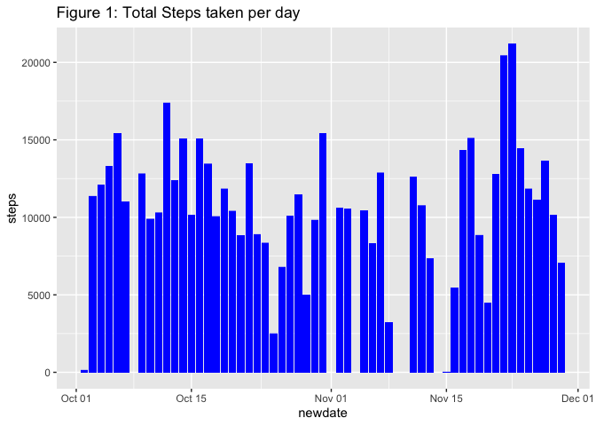
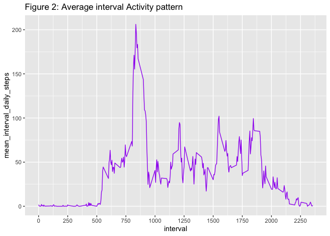
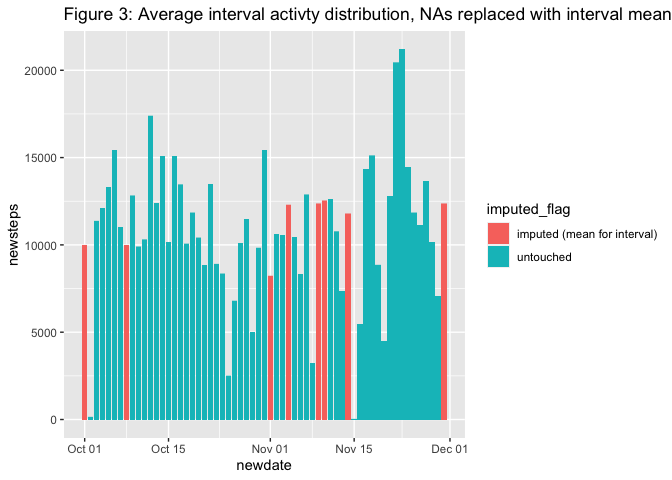
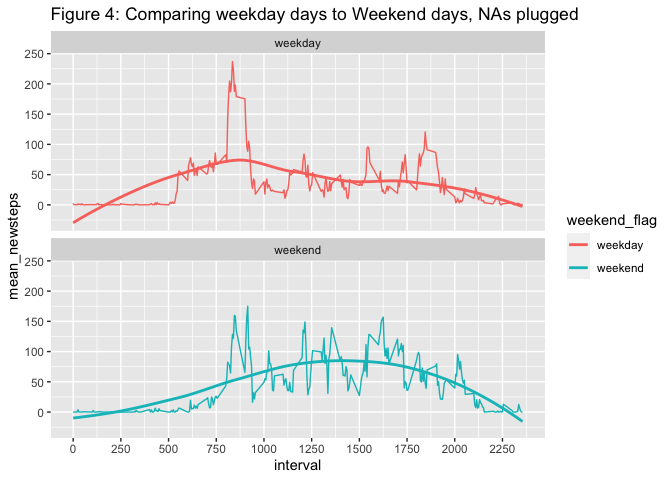

# Activity Monitoring

Data has been collected using one of several devices such as a Fitbit, Nike Fuelband, or Jawbone Up. 

* collected at 5 minute intervals through out the day
* one anonymous individual
* collected during the months of October and November, 2012
* includes the number of steps taken in 5 minute intervals each day -- this is the activity level


## Package Requirements 

Also reported below are the R and system details.

```r
library(tidyverse)
```

```
## ── Attaching packages ───────────────────────────────────────────────────────────────────────────────────────────────────────────────────────────────────────────────────────────────────────────────────────────────────────────────────────────────────────────────────────────── tidyverse 1.3.0 ──
```

```
## ✓ ggplot2 3.3.2     ✓ purrr   0.3.4
## ✓ tibble  3.0.3     ✓ dplyr   1.0.1
## ✓ tidyr   1.1.1     ✓ stringr 1.4.0
## ✓ readr   1.3.1     ✓ forcats 0.5.0
```

```
## ── Conflicts ──────────────────────────────────────────────────────────────────────────────────────────────────────────────────────────────────────────────────────────────────────────────────────────────────────────────────────────────────────────────────────────────── tidyverse_conflicts() ──
## x dplyr::filter() masks stats::filter()
## x dplyr::lag()    masks stats::lag()
```

```r
R.version
```

```
##                _                           
## platform       x86_64-apple-darwin15.6.0   
## arch           x86_64                      
## os             darwin15.6.0                
## system         x86_64, darwin15.6.0        
## status                                     
## major          3                           
## minor          6.2                         
## year           2019                        
## month          12                          
## day            12                          
## svn rev        77560                       
## language       R                           
## version.string R version 3.6.2 (2019-12-12)
## nickname       Dark and Stormy Night
```

## Loading and preprocessing the data -- raw_data_in

There were no issues reading the data in.  We report when we downloaded the data (in case of updates), and then check for the unzipped source file (which will be unzipped as needed).


```r
zip_file_download<-file.info("activity.zip") %>% mutate(zip_file_download=mtime) %>% select(zip_file_download)
zip_file_download
```

```
##     zip_file_download
## 1 2020-08-24 06:05:50
```

```r
data_read_in_timestamp=Sys.time()
data_read_in_timestamp
```

```
## [1] "2020-08-25 17:56:37 MDT"
```

```r
ifelse(file.exists("activity.csv")==TRUE, 
       "activity.csv available",
       unzip("activity.zip", junkpaths=TRUE, exdir = "."))
```

```
## [1] "activity.csv available"
```

```r
raw_data_in <- read.csv("activity.csv")
head(raw_data_in)
```

```
##   steps       date interval
## 1    NA 2012-10-01        0
## 2    NA 2012-10-01        5
## 3    NA 2012-10-01       10
## 4    NA 2012-10-01       15
## 5    NA 2012-10-01       20
## 6    NA 2012-10-01       25
```

## Data checks -- raw_data_in

Here are some simple checks to see what our data look like...

1. We confirm the expected data record counts (n=17,568)

```r
nrow(raw_data_in)
```

```
## [1] 17568
```

2. Summary of **steps** variable


```r
summary(raw_data_in$steps)
```

```
##    Min. 1st Qu.  Median    Mean 3rd Qu.    Max.    NA's 
##    0.00    0.00    0.00   37.38   12.00  806.00    2304
```

3. Summary of **interval** variable


```r
summary(raw_data_in$interval)
```

```
##    Min. 1st Qu.  Median    Mean 3rd Qu.    Max. 
##     0.0   588.8  1177.5  1177.5  1766.2  2355.0
```

4. Stability check, for any one date (24 hour period), we should see 288 records (288 x 5 minutes per interval = 1440 minutes, 1440 minutes / 60 = 24 hours). This validates.


```r
distinct(count(raw_data_in,date),n)
```

```
##     n
## 1 288
```

## Creating the main data frame -- activity_data

Here we will make the main data frame, as you can see we create some helpful variables (to be used later).

### New variables added to raw data:

* **newdate** This is the raw character date in Date format
* **char_interval** (dropped) Used to separate Hour and Minutes
* **char_interval_length** (dropped) Used to decide substring particulars
* **newdatetime1** (dropped) Used to isolate pretty time
* **interval_tod** pretty interval TOD, eases research as you can easily see what TOD activity occurs
* **weekday** day of week
* **weekend_flag** flag denoting day of week is during week or weekend
* **month** month


```r
activity_data <- raw_data_in %>%
	mutate(
		newdate = as.Date(date),
		char_interval = as.character(interval),
		char_interval_length = str_length(char_interval),
		newdatetime1 = ISOdatetime(
			as.numeric(word(date, 1, sep = "-")),
			as.numeric(word(date, 2, sep = "-")),
			as.numeric(word(date, 3, sep = "-")),
			as.numeric(ifelse(
				char_interval_length == 4,
				substr(char_interval, 1, 2),
				ifelse(char_interval_length == 3, substr(char_interval, 1, 1), "0"))),
			as.numeric(ifelse(
				char_interval_length == 4,
				substr(char_interval, 3, 4),
				ifelse(char_interval_length == 3, substr(char_interval, 2, 3), 
				       ifelse(char_interval_length == 2, substr(char_interval,1,2), str_c("0",char_interval))))),
			0),
		interval_tod = strftime(newdatetime1, format = "%I:%M %p"),
		weekday = weekdays.Date(newdate),
		weekend_flag = ifelse(weekday %in% c("Saturday", "Sunday"), "weekend", "weekday"),
		month=str_c(word(date,2,sep="-"), ": ", months(newdate))
	) %>%
	select(-char_interval:-newdatetime1)
```


## What is mean total number of steps taken per day?

**Figure 1** shows activity level for each day.  We note the existence of 2,304 NAs for the steps variable.  Most data appear to be around 10,000 steps, which is supported by the mean/median reported above.


```r
#--# histogram of the total number of steps taken each day
ggplot(data = activity_data) +
	geom_col(mapping = aes(x=newdate, y=steps), fill="blue") +
#	geom_histogram(mapping = aes(x=steps), fill="blue") +
	ggtitle("Figure 1: Total Steps taken per day")
```

```
## Warning: Removed 2304 rows containing missing values (position_stack).
```

<!-- -->

The mean and median daily steps:


```r
#--# report the mean and median total number of steps taken per day
activity_data %>% select(newdate, steps) %>%
	group_by(newdate) %>%
	summarise(total_daily_steps=sum(steps, na.rm = TRUE)) %>%
	ungroup %>% 
		summarize(mean_daily_steps=mean(total_daily_steps, na.rm = TRUE),
			  median_daily_steps=median(total_daily_steps, na.rm = TRUE))
```

```
## `summarise()` ungrouping output (override with `.groups` argument)
```

```
## # A tibble: 1 x 2
##   mean_daily_steps median_daily_steps
##              <dbl>              <int>
## 1            9354.              10395
```

## What is the average daily activity pattern?

Here we will examine the patterns in activity by grouping the intervals/steps across days. **Figure 2** shows such activity -- note, the width of the output here is (as expected) 24 hours.


```r
interval_activity <- activity_data %>% 
	select(interval, interval_tod, steps) %>%
	group_by(interval, interval_tod) %>% 
	summarise(mean_interval_daily_steps=mean(steps, na.rm = TRUE)) %>% ungroup
```

```
## `summarise()` regrouping output by 'interval' (override with `.groups` argument)
```

```r
#--# time series plot of the 5-minute interval (x-axis) and the average number of steps taken, averaged across all days
ggplot(interval_activity) +
	geom_line(mapping = aes(x=interval, y=mean_interval_daily_steps), color="purple") +
	scale_x_continuous(n.breaks = 12) +
	ggtitle("Figure 2: Average interval Activity pattern")
```

<!-- -->

This tells us the interval with the highest average daily steps is interval 835, averaging over 206 steps (across our timeframe, October, 2012 through November, 2012).  The time associated with the highest average activity corresponds to 1:55pm, which makes intuitive sense (at least it was not during sleeping hours).  The gaps observed in the plot are confirmed to be zero activity intervals.


```r
#--# maximum number of steps
interval_activity %>% 
	select(interval, interval_tod, mean_interval_daily_steps) %>% 
	filter(mean_interval_daily_steps==max(interval_activity$mean_interval_daily_steps))
```

```
## # A tibble: 1 x 3
##   interval interval_tod mean_interval_daily_steps
##      <int> <chr>                            <dbl>
## 1      835 08:35 AM                          206.
```

## Imputing missing values -- activity_data2

As we noted above, when we plot the steps, we encounter NAs for over 2,300 records.  Here we will examine the NA mix with respect to the dates, and also see what it looks like when we have zeroes for steps.

To plug our data, we will calculate the imputed values based on the following key:
* **weekend_flag** this may help add precision by addressing distinctively weekend activities
* **interval** more precision -- different periods of the day may experience patterns of higher/lower activity
* **interval_tod** same level as interval (interval and interval_tod are the same)

We take a look at the plugs...we can see that by plugging at the weekend_flag level the more active weekend values are more precise (as opposed to a more general approach).

```r
interval_activity_plugs <- activity_data %>% 
	# select(month, weekend_flag, interval, interval_tod, steps) %>%
	# group_by(month, weekend_flag, interval, interval_tod) %>% 
	select(weekend_flag, interval, interval_tod, steps) %>%
	group_by(weekend_flag, interval, interval_tod) %>% 
	summarise(mean_interval_daily_steps=mean(steps, na.rm = TRUE)) %>% ungroup
```

```
## `summarise()` regrouping output by 'weekend_flag', 'interval' (override with `.groups` argument)
```

```r
str(interval_activity_plugs)
```

```
## tibble [576 × 4] (S3: tbl_df/tbl/data.frame)
##  $ weekend_flag             : chr [1:576] "weekday" "weekday" "weekday" "weekday" ...
##  $ interval                 : int [1:576] 0 5 10 15 20 25 30 35 40 45 ...
##  $ interval_tod             : chr [1:576] "12:00 AM" "12:05 AM" "12:10 AM" "12:15 AM" ...
##  $ mean_interval_daily_steps: num [1:576] 2.333 0.462 0.179 0.205 0.103 ...
```

```r
interval_activity_plugs %>%
	# select(month, weekend_flag, mean_interval_daily_steps) %>%
	# group_by(month, weekend_flag) %>%
	select(weekend_flag, mean_interval_daily_steps) %>%
	group_by(weekend_flag) %>%
	summarise(max_mean_interval_daily_steps=mean(mean_interval_daily_steps))
```

```
## `summarise()` ungrouping output (override with `.groups` argument)
```

```
## # A tibble: 2 x 2
##   weekend_flag max_mean_interval_daily_steps
##   <chr>                                <dbl>
## 1 weekday                               35.3
## 2 weekend                               43.1
```

We take a second look at the plugs...we can see that by plugging at the weekday level the more active weekend values are more precise (as opposed to a more general approach).  With Wednesday looking like a weekend day (much larger than the other weekdays), I believe this should lend a more accurate solution than just separating the weekend_flag.


```r
interval_activity_plugs <- activity_data %>% 
	# select(month, weekend_flag, interval, interval_tod, steps) %>%
	# group_by(month, weekend_flag, interval, interval_tod) %>% 
	select(weekday, interval, interval_tod, steps) %>%
	group_by(weekday, interval, interval_tod) %>% 
	summarise(mean_interval_daily_steps=mean(steps, na.rm = TRUE)) %>% ungroup
```

```
## `summarise()` regrouping output by 'weekday', 'interval' (override with `.groups` argument)
```

```r
str(interval_activity_plugs)
```

```
## tibble [2,016 × 4] (S3: tbl_df/tbl/data.frame)
##  $ weekday                  : chr [1:2016] "Friday" "Friday" "Friday" "Friday" ...
##  $ interval                 : int [1:2016] 0 5 10 15 20 25 30 35 40 45 ...
##  $ interval_tod             : chr [1:2016] "12:00 AM" "12:05 AM" "12:10 AM" "12:15 AM" ...
##  $ mean_interval_daily_steps: num [1:2016] 0 0 0 0 0 0 0 0 0 0 ...
```

```r
interval_activity_plugs %>%
	# select(month, weekend_flag, mean_interval_daily_steps) %>%
	# group_by(month, weekend_flag) %>%
	select(weekday, mean_interval_daily_steps) %>%
	group_by(weekday) %>%
	summarise(max_mean_interval_daily_steps=mean(mean_interval_daily_steps))
```

```
## `summarise()` ungrouping output (override with `.groups` argument)
```

```
## # A tibble: 7 x 2
##   weekday   max_mean_interval_daily_steps
##   <chr>                             <dbl>
## 1 Friday                             42.9
## 2 Monday                             34.6
## 3 Saturday                           43.5
## 4 Sunday                             42.6
## 5 Thursday                           28.5
## 6 Tuesday                            31.1
## 7 Wednesday                          40.9
```

First, two new variables are created, newsteps will be the original value for steps normally, but for NA records we will join on the average activity per interval (created above, interval_activity data frame). A flag is created to more easily see what we have plugged (imputed_flag).


```r
activity_data2 <- activity_data %>% 
#	inner_join(interval_activity_plugs, by = c("month", "weekend_flag", "interval", "interval_tod"))  %>%
	inner_join(interval_activity_plugs, by = c("weekday", "interval", "interval_tod"))  %>%
	mutate(newsteps=ifelse(is.na(steps)==TRUE, mean_interval_daily_steps, steps),
	       imputed_flag=ifelse(is.na(steps)==TRUE, "imputed (mean for interval)", "untouched")) %>%
	arrange(newdate, interval)
nrow(activity_data2)==nrow(activity_data)
```

```
## [1] TRUE
```

```r
str(activity_data2)
```

```
## 'data.frame':	17568 obs. of  11 variables:
##  $ steps                    : int  NA NA NA NA NA NA NA NA NA NA ...
##  $ date                     : Factor w/ 61 levels "2012-10-01","2012-10-02",..: 1 1 1 1 1 1 1 1 1 1 ...
##  $ interval                 : int  0 5 10 15 20 25 30 35 40 45 ...
##  $ newdate                  : Date, format: "2012-10-01" "2012-10-01" ...
##  $ interval_tod             : chr  "12:00 AM" "12:05 AM" "12:10 AM" "12:15 AM" ...
##  $ weekday                  : chr  "Monday" "Monday" "Monday" "Monday" ...
##  $ weekend_flag             : chr  "weekday" "weekday" "weekday" "weekday" ...
##  $ month                    : chr  "10: October" "10: October" "10: October" "10: October" ...
##  $ mean_interval_daily_steps: num  1.43 0 0 0 0 ...
##  $ newsteps                 : num  1.43 0 0 0 0 ...
##  $ imputed_flag             : chr  "imputed (mean for interval)" "imputed (mean for interval)" "imputed (mean for interval)" "imputed (mean for interval)" ...
```

```r
#count(activity_data, month, weekend_flag, weekday)
#count(activity_data2, weekend_flag, weekday)
```

Here is the count of missings from our original data, we need to fix these up...


```r
#--# report the total number of missing values in the dataset
count(activity_data, is.na(steps))
```

```
##   is.na(steps)     n
## 1        FALSE 15264
## 2         TRUE  2304
```

Now, let's see what comes through in the plugged steps variable (newsteps). **Figure 3** shows us a picture of what the new activity looks like, with the data we imputed/plugged.  You can see that any plugging occurred all or nothing, either all were NA before in a day, or none.


```r
#--# histogram of the total number of steps taken each day
ggplot(data = activity_data2) +
	geom_col(mapping = aes(x=newdate, y=newsteps, fill=imputed_flag)) +
#	geom_histogram(stat="identity", mapping = aes(y=newsteps, x=newdate, fill=imputed_flag)) +
	ggtitle("Figure 3: Average interval activty distribution, NAs replaced with interval means")
```

<!-- -->

This shows the change in mean/median due to our imputation process.  The mean rises by 15%.


```r
#--# report the mean and median total number of steps taken per day, using replica data with plugs
temp <- activity_data2 %>% 
	select(newdate, steps, newsteps) %>%
	group_by(newdate) %>%
		summarise(total_daily_steps=sum(steps, na.rm = TRUE),
			  total_daily_newsteps=sum(newsteps, na.rm = TRUE)) %>%
	ungroup %>%
	summarise(mean_daily_steps=mean(total_daily_steps, na.rm = TRUE),
		  med_daily_steps=median(total_daily_steps, na.rm = TRUE),
		  mean_daily_newsteps=mean(total_daily_newsteps, na.rm = TRUE),
		  med_daily_newsteps=median(total_daily_newsteps, na.rm = TRUE)) %>%
	mutate(pct_increase_mean=(mean_daily_newsteps-mean_daily_steps)/mean_daily_steps,
	       pct_increase_med=(med_daily_newsteps-med_daily_steps)/med_daily_steps)
```

```
## `summarise()` ungrouping output (override with `.groups` argument)
```

```r
temp %>% select(mean_daily_steps, med_daily_steps)
```

```
## # A tibble: 1 x 2
##   mean_daily_steps med_daily_steps
##              <dbl>           <int>
## 1            9354.           10395
```

```r
temp %>% select(mean_daily_newsteps, med_daily_newsteps)
```

```
## # A tibble: 1 x 2
##   mean_daily_newsteps med_daily_newsteps
##                 <dbl>              <dbl>
## 1              10821.              11015
```

```r
temp %>% select(pct_increase_mean)
```

```
## # A tibble: 1 x 1
##   pct_increase_mean
##               <dbl>
## 1             0.157
```

# Are there differences in activity patterns between weekdays and weekends?

Differences in activity levels can be observed for this subject (recall this is one person's data, October/November).  Looking at **Figure 4**, one notices more early morning activity during the week.  Weekends look as if the subject is less active in the morning, but once the day unfolds activity levels increase above weekday levels and maintain.


```r
#--# panel plot containing a time series plot
for_panel_plot <- activity_data2 %>%
	select(weekend_flag, interval, newsteps) %>%
	group_by(weekend_flag, interval) %>%
	summarise(mean_newsteps=mean(newsteps))
```

```
## `summarise()` regrouping output by 'weekend_flag' (override with `.groups` argument)
```

```r
ggplot(for_panel_plot) +
	geom_line(mapping = aes(x=interval, y=mean_newsteps, color=weekend_flag)) +
	geom_smooth(mapping = aes(x=interval, y=mean_newsteps, color=weekend_flag), se=FALSE) +
	scale_x_continuous(n.breaks = 12) +
#	scale_x_continuous(breaks = c(500:2100, 100)) +
	facet_wrap(~weekend_flag, nrow=2, ncol=1) +
 	ggtitle("Figure 4: Comparing weekday days to Weekend days, NAs plugged")
```

```
## `geom_smooth()` using method = 'loess' and formula 'y ~ x'
```

<!-- -->

