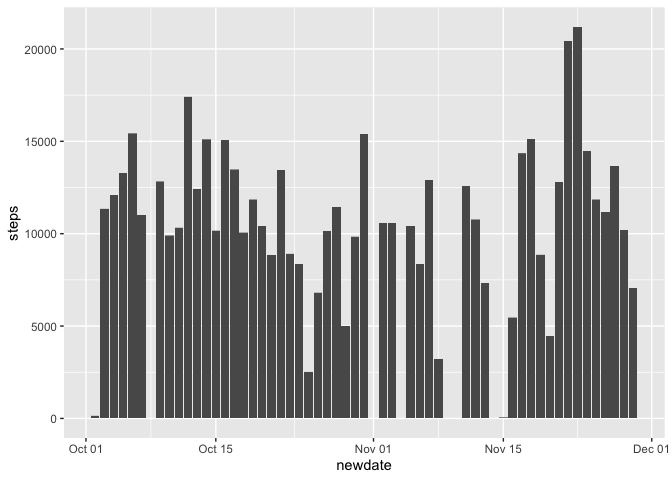
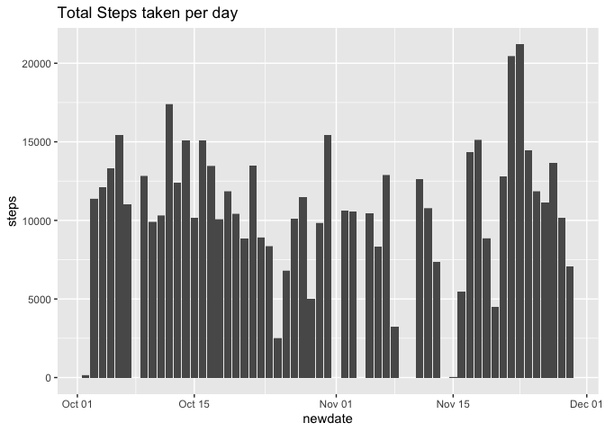
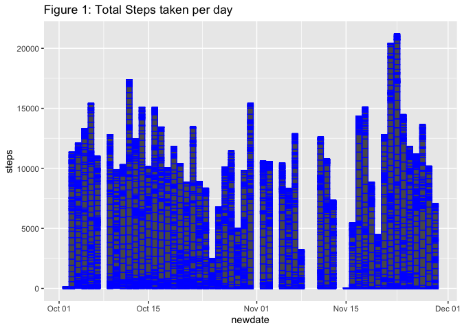
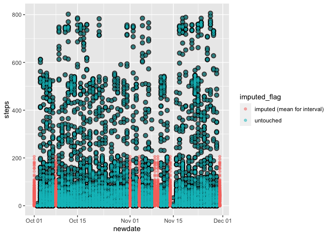
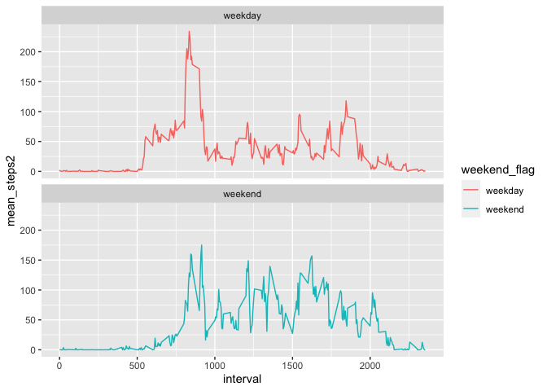

Need dplyr/ggplot2 for manipulation


```r
require(dplyr)
```

```
## Loading required package: dplyr
```

```
## 
## Attaching package: 'dplyr'
```

```
## The following objects are masked from 'package:stats':
## 
##     filter, lag
```

```
## The following objects are masked from 'package:base':
## 
##     intersect, setdiff, setequal, union
```

```r
require(ggplot2)
```

```
## Loading required package: ggplot2
```

## Loading and preprocessing the data
## unzip file if not there...

```r
ifelse(file.exists("activity.csv")==TRUE, 
       "activity.csv available",
       unzip("activity.zip", junkpaths=TRUE, exdir = "."))
```

```
## [1] "activity.csv available"
```

```r
raw_data_in <- read.csv("activity.csv")
head(raw_data_in)
```

```
##   steps       date interval
## 1    NA 2012-10-01        0
## 2    NA 2012-10-01        5
## 3    NA 2012-10-01       10
## 4    NA 2012-10-01       15
## 5    NA 2012-10-01       20
## 6    NA 2012-10-01       25
```

```r
summary(raw_data_in$steps)
```

```
##    Min. 1st Qu.  Median    Mean 3rd Qu.    Max.    NA's 
##    0.00    0.00    0.00   37.38   12.00  806.00    2304
```

```r
summary(raw_data_in$interval)
```

```
##    Min. 1st Qu.  Median    Mean 3rd Qu.    Max. 
##     0.0   588.8  1177.5  1177.5  1766.2  2355.0
```

```r
nrow(raw_data_in)
```

```
## [1] 17568
```

```r
count(count(raw_data_in,interval),n)
```

```
## Storing counts in `nn`, as `n` already present in input
## ℹ Use `name = "new_name"` to pick a new name.
```

```
##    n  nn
## 1 61 288
```

```r
count(count(raw_data_in,date),n)
```

```
## Storing counts in `nn`, as `n` already present in input
## ℹ Use `name = "new_name"` to pick a new name.
```

```
##     n nn
## 1 288 61
```


## What is mean total number of steps taken per day?

```r
activity_data <-raw_data_in %>%
	mutate(newdate=as.Date(date)) %>% 
	group_by(newdate) %>%
	mutate(total_steps_per_day=sum(steps, na.rm = TRUE))

activity_data %>% distinct(newdate, total_steps_per_day) %>%
	ungroup %>%
	summarise(
	mean_steps_per_day=mean(total_steps_per_day, na.rm = TRUE),
	median_steps_per_day=median(total_steps_per_day, na.rm = TRUE))
```

```
## # A tibble: 1 x 2
##   mean_steps_per_day median_steps_per_day
##                <dbl>                <int>
## 1              9354.                10395
```

```r
ggplot(data = activity_data) +
	geom_col(mapping = aes(x=newdate, y=steps), color="purple")
```

```
## Warning: Removed 2304 rows containing missing values (position_stack).
```

<!-- -->

## What is the average daily activity pattern?

```r
interval_activity <- activity_data %>% 
	ungroup %>% 
	group_by(interval) %>% 
	summarise(mean_interval_steps_per_day=mean(steps, na.rm = TRUE))
```

```
## `summarise()` ungrouping output (override with `.groups` argument)
```

```r
ggplot(interval_activity) +
	geom_line(mapping = aes(x=interval, y=mean_interval_steps_per_day))
```

<!-- -->

```r
max<-interval_activity %>% ungroup %>% mutate(max=max(mean_interval_steps_per_day)) %>% distinct(max)
str(max)
```

```
## tibble [1 × 1] (S3: tbl_df/tbl/data.frame)
##  $ max: num 206
```

```r
max
```

```
## # A tibble: 1 x 1
##     max
##   <dbl>
## 1  206.
```

```r
interval_activity %>% filter(mean_interval_steps_per_day==max(interval_activity$mean_interval_steps_per_day))
```

```
## # A tibble: 1 x 2
##   interval mean_interval_steps_per_day
##      <int>                       <dbl>
## 1      835                        206.
```

## Imputing missing values


```r
activity_data2 <- activity_data %>% ungroup %>%
	left_join(interval_activity, by = "interval") %>% 
#	mutate(newtotalsteps=ifelse(is.na(steps)==TRUE, mean_interval_steps_per_day, total_steps_per_day))
	mutate(newtotalsteps=ifelse(is.na(steps)==TRUE, mean_interval_steps_per_day, steps),
	       imputed_flag=ifelse(is.na(steps)==TRUE, "imputed (mean for interval)", "untouched")) %>% ungroup

## looking at the NA's for steps, along with the zero values...
tx<-activity_data%>%
	ungroup%>% 
	mutate(na_steps=is.na(steps), zero_steps=(steps==0)) %>% group_by(newdate)
#	count(is.na(steps),steps==0)
tx%>%filter(na_steps==TRUE)%>%distinct(newdate)
```

```
## # A tibble: 8 x 1
## # Groups:   newdate [8]
##   newdate   
##   <date>    
## 1 2012-10-01
## 2 2012-10-08
## 3 2012-11-01
## 4 2012-11-04
## 5 2012-11-09
## 6 2012-11-10
## 7 2012-11-14
## 8 2012-11-30
```

```r
ggplot(data = activity_data2) +
#	geom_col(mapping = aes(x=newdate, y=newtotalsteps, fill=imputed_flag)) +
#	geom_col(data=activity_data, mapping = aes(x=newdate, y=steps)) +
	geom_col(mapping = aes(x=newdate, y=newtotalsteps, fill=imputed_flag)) 
```

<!-- -->

```r
# +
# 	geom_col(data=activity_data, mapping = aes(x=newdate, y=steps), alpha=.5, color="black")

ggplot(data = activity_data2) +
#	geom_col(mapping = aes(x=newdate, y=newtotalsteps, fill=imputed_flag)) +
#	geom_col(data=activity_data, mapping = aes(x=newdate, y=steps)) +
#	geom_jitter(mapping = aes(x=newdate, y=newtotalsteps, fill=imputed_flag, color=imputed_flag), alpha=.5) +
	geom_point(data=activity_data, mapping = aes(x=newdate, y=steps), alpha=.7, color="black", size=3) +
	geom_point(mapping = aes(x=newdate, y=newtotalsteps, fill=imputed_flag, color=imputed_flag), alpha=.5, size=1.5)
```

```
## Warning: Removed 2304 rows containing missing values (geom_point).
```

<!-- -->

```r
activity_data2 %>% ungroup %>% distinct(newdate, newtotalsteps) %>%
	#ungroup %>%
	summarise(
	mean_steps_per_day=mean(newtotalsteps, na.rm = TRUE),
	median_steps_per_day=median(newtotalsteps, na.rm = TRUE))
```

```
## # A tibble: 1 x 2
##   mean_steps_per_day median_steps_per_day
##                <dbl>                <dbl>
## 1               112.                 50.0
```

# Are there differences in activity patterns between weekdays and weekends?


```r
weekdaysx <- weekdays(activity_data$newdate)

activity_data3 <- data.frame(activity_data2, weekdaysx) %>% mutate(weekend_flag=ifelse(weekdaysx %in% c("Saturday","Sunday"), "weekend", "weekday"))
head(activity_data3)
```

```
##   steps       date interval    newdate total_steps_per_day
## 1    NA 2012-10-01        0 2012-10-01                   0
## 2    NA 2012-10-01        5 2012-10-01                   0
## 3    NA 2012-10-01       10 2012-10-01                   0
## 4    NA 2012-10-01       15 2012-10-01                   0
## 5    NA 2012-10-01       20 2012-10-01                   0
## 6    NA 2012-10-01       25 2012-10-01                   0
##   mean_interval_steps_per_day newtotalsteps                imputed_flag
## 1                   1.7169811     1.7169811 imputed (mean for interval)
## 2                   0.3396226     0.3396226 imputed (mean for interval)
## 3                   0.1320755     0.1320755 imputed (mean for interval)
## 4                   0.1509434     0.1509434 imputed (mean for interval)
## 5                   0.0754717     0.0754717 imputed (mean for interval)
## 6                   2.0943396     2.0943396 imputed (mean for interval)
##   weekdaysx weekend_flag
## 1    Monday      weekday
## 2    Monday      weekday
## 3    Monday      weekday
## 4    Monday      weekday
## 5    Monday      weekday
## 6    Monday      weekday
```

```r
count(activity_data3, weekend_flag)
```

```
##   weekend_flag     n
## 1      weekday 12960
## 2      weekend  4608
```

```r
activity_data4 <- activity_data3 %>% group_by(weekend_flag, interval) %>% summarize(mean_steps=mean(newtotalsteps), mean_steps2=mean(steps, na.rm = TRUE))
```

```
## `summarise()` regrouping output by 'weekend_flag' (override with `.groups` argument)
```

```r
head(activity_data4)
```

```
## # A tibble: 6 x 4
## # Groups:   weekend_flag [1]
##   weekend_flag interval mean_steps mean_steps2
##   <chr>           <int>      <dbl>       <dbl>
## 1 weekday             0     2.25         2.33 
## 2 weekday             5     0.445        0.462
## 3 weekday            10     0.173        0.179
## 4 weekday            15     0.198        0.205
## 5 weekday            20     0.0990       0.103
## 6 weekday            25     1.59         1.51
```

```r
ggplot(activity_data4) +
	geom_line(mapping = aes(x=interval, y=mean_steps2, color=weekend_flag)) +
#	geom_smooth(mapping = aes(x=interval, y=mean_steps2, color=weekend_flag)) +
#	geom_abline(mapping = aes(intercept=mean(activity_data4$mean_steps2), slope=0)) +
	facet_wrap(~weekend_flag, nrow=2, ncol=1)
```

<!-- -->

```r
activity_data4%>%group_by(weekend_flag)%>%summarize(mean_steps=mean(mean_steps), mean_steps2=mean(mean_steps2))
```

```
## `summarise()` ungrouping output (override with `.groups` argument)
```

```
## # A tibble: 2 x 3
##   weekend_flag mean_steps mean_steps2
##   <chr>             <dbl>       <dbl>
## 1 weekday            35.6        35.3
## 2 weekend            42.4        43.1
```

# This concludes the work (finish later)...
