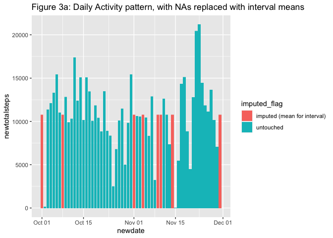
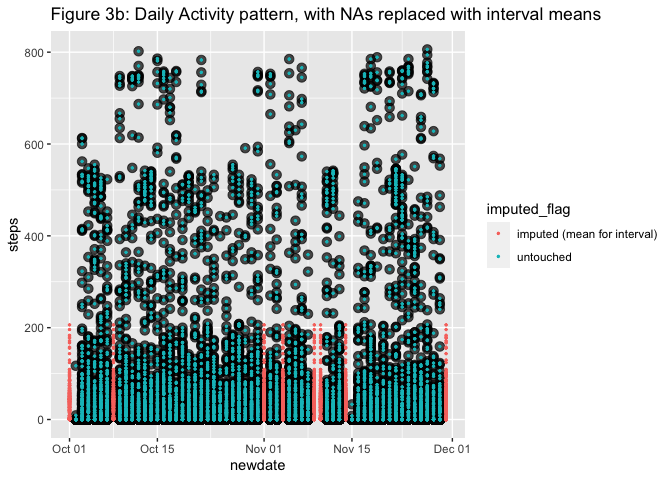
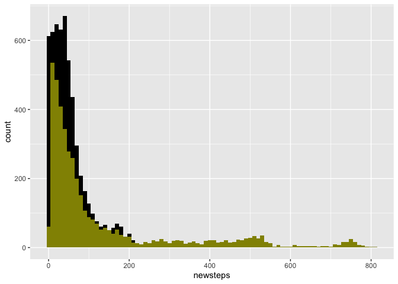
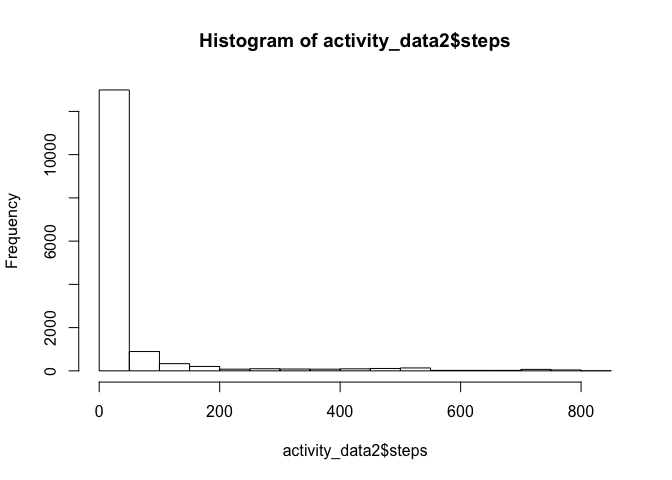
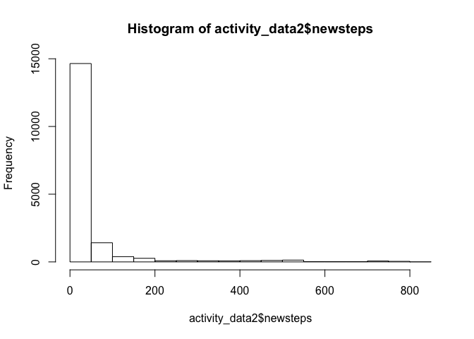
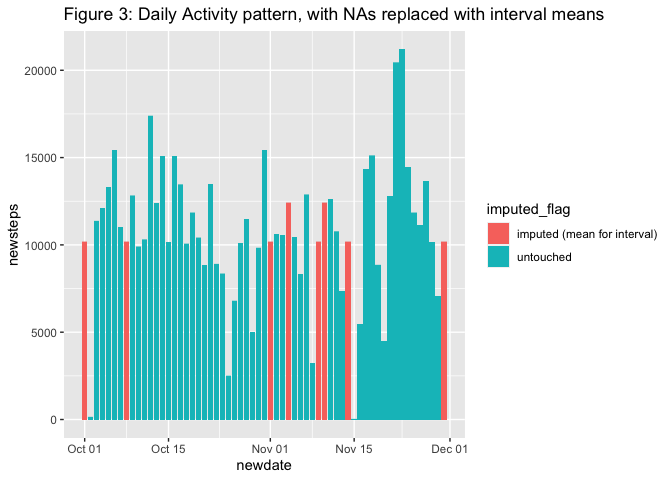

# Activity Monitoring

Data has been collected using one of several devices such as a Fitbit, Nike Fuelband, or Jawbone Up. 

* collected at 5 minute intervals through out the day
* one anonymous individual
* collected during the months of October and November, 2012
* includes the number of steps taken in 5 minute intervals each day


## Package Requirements


```r
library(tidyverse)
```

```
## ── Attaching packages ──────────────────────────────────────────────────────────────────────────────────────────────────────────────────────────────────────────────────────────────────────────────────────────── tidyverse 1.3.0 ──
```

```
## ✓ ggplot2 3.3.2     ✓ purrr   0.3.4
## ✓ tibble  3.0.3     ✓ dplyr   1.0.1
## ✓ tidyr   1.1.1     ✓ stringr 1.4.0
## ✓ readr   1.3.1     ✓ forcats 0.5.0
```

```
## ── Conflicts ─────────────────────────────────────────────────────────────────────────────────────────────────────────────────────────────────────────────────────────────────────────────────────────────── tidyverse_conflicts() ──
## x dplyr::filter() masks stats::filter()
## x dplyr::lag()    masks stats::lag()
```

## Loading and preprocessing the data

The data is straightforward, there were no issues reading the data in.


```r
ifelse(file.exists("activity.csv")==TRUE, 
       "activity.csv available",
       unzip("activity.zip", junkpaths=TRUE, exdir = "."))
```

```
## [1] "activity.csv available"
```

```r
raw_data_in <- read.csv("activity.csv")
head(raw_data_in)
```

```
##   steps       date interval
## 1    NA 2012-10-01        0
## 2    NA 2012-10-01        5
## 3    NA 2012-10-01       10
## 4    NA 2012-10-01       15
## 5    NA 2012-10-01       20
## 6    NA 2012-10-01       25
```

Here are some simple checks to see what the steps (this variable is the main measure) and interval variables look like.  We also examine the consistency in terms of records with respect to intervals in a day. 

We confirm the expected data record counts (n=17,568).

For any one date (24 hour period), we should see 288 records (288 x 5 minutes per interval = 1440 minutes, 1440 minutes / 60 = 24 hours). This validates.


```r
summary(raw_data_in$steps)
```

```
##    Min. 1st Qu.  Median    Mean 3rd Qu.    Max.    NA's 
##    0.00    0.00    0.00   37.38   12.00  806.00    2304
```

```r
summary(raw_data_in$interval)
```

```
##    Min. 1st Qu.  Median    Mean 3rd Qu.    Max. 
##     0.0   588.8  1177.5  1177.5  1766.2  2355.0
```

```r
nrow(raw_data_in)
```

```
## [1] 17568
```

```r
distinct(count(raw_data_in,interval),n)
```

```
##    n
## 1 61
```

```r
distinct(count(raw_data_in,date),n)
```

```
##     n
## 1 288
```

## What is mean total number of steps taken per day?

The first step in answering this question is to group the data by our newdate variable (newdate is a simple as.Date function applied to original). We exclude the NAs in this calculation.  The activity_data data frame will have all the original records, plus for each date the total steps for that date (repeated on all records).  

We then take the distinct (by newdate, and the repeating total_steps_per_day), then calculate the mean/median steps.


```r
activity_data <-raw_data_in %>%
	mutate(newdate=as.Date(date))

activity_data %>% select(newdate, steps) %>%
	group_by(newdate) %>%
	summarise(total_steps_per_day=sum(steps, na.rm = TRUE)) %>%
	ungroup %>% 
		summarize(mean_daily_steps=mean(total_steps_per_day, na.rm = TRUE),
			  median_daily_steps=median(total_steps_per_day, na.rm = TRUE))
```

```
## `summarise()` ungrouping output (override with `.groups` argument)
```

```
## # A tibble: 1 x 2
##   mean_daily_steps median_daily_steps
##              <dbl>              <int>
## 1            9354.              10395
```

**Figure 1** shows activity level for each day.  We note the existence of 2,304 NAs for the steps variable.  Most data appear to be around 10,000 steps, which is supported by the mean/median reported above.


```r
ggplot(data = activity_data) +
	geom_col(mapping = aes(x=newdate, y=steps), fill="blue") +
	ggtitle("Figure 1: Total Steps taken per day")
```

```
## Warning: Removed 2304 rows containing missing values (position_stack).
```

<!-- -->

## What is the average daily activity pattern?

Here we will examine the patterns in activity by grouping the intervals/steps across days. **Figure 2** shows such activity -- note, the width of the output here is (as expected) 24 hours.


```r
interval_activity <- activity_data %>% 
	select(interval, steps) %>%
	group_by(interval) %>% 
	summarise(mean_interval_steps_per_day=mean(steps, na.rm = TRUE))
```

```
## `summarise()` ungrouping output (override with `.groups` argument)
```

```r
ggplot(interval_activity) +
	geom_line(mapping = aes(x=interval, y=mean_interval_steps_per_day)) +
	ggtitle("Figure 2: Daily Activity pattern")
```

<!-- -->

From our data, we see that interval 835 is the 5-minute period with the highest average activity (206 steps). The time associated with the highest average activity corresponds to 1:55pm, which makes intuitive sense.


```r
most_active <- interval_activity %>% filter(mean_interval_steps_per_day==max(interval_activity$mean_interval_steps_per_day))
most_active
```

```
## # A tibble: 1 x 2
##   interval mean_interval_steps_per_day
##      <int>                       <dbl>
## 1      835                        206.
```

```r
max_tod<-str_c(as.character(floor(most_active$interval/60)),
	       ":", 
	       as.character(((most_active$interval/60)-floor(most_active$interval/60)) * 60))
max_tod
```

```
## [1] "13:55"
```

## Imputing missing values

As we noted above, when we plot the steps, we encounter NAs for over 2,300 records.  Here we will examine the NA mix with respect to the dates, and also see what it looks like when we have zeroes for steps.

The dates below are the days where we had all NAs -- there were no interval imputations within any day (if one interval was NA, all 288 intervals were NA).


```r
na_check <- activity_data %>%
	mutate(na_steps=is.na(steps), 
	       zero_steps=(steps==0),
	       imputed_flag=ifelse(is.na(steps)==TRUE, "imputed (mean for interval)", "untouched")) %>% 
	group_by(newdate) %>%
	filter(na_steps==TRUE)%>%
	distinct(newdate, na_steps, zero_steps, imputed_flag, steps)
na_check
```

```
## # A tibble: 8 x 5
## # Groups:   newdate [8]
##   steps newdate    na_steps zero_steps imputed_flag               
##   <int> <date>     <lgl>    <lgl>      <chr>                      
## 1    NA 2012-10-01 TRUE     NA         imputed (mean for interval)
## 2    NA 2012-10-08 TRUE     NA         imputed (mean for interval)
## 3    NA 2012-11-01 TRUE     NA         imputed (mean for interval)
## 4    NA 2012-11-04 TRUE     NA         imputed (mean for interval)
## 5    NA 2012-11-09 TRUE     NA         imputed (mean for interval)
## 6    NA 2012-11-10 TRUE     NA         imputed (mean for interval)
## 7    NA 2012-11-14 TRUE     NA         imputed (mean for interval)
## 8    NA 2012-11-30 TRUE     NA         imputed (mean for interval)
```

First, two new variables are created, newsteps will be the original value for steps normally, but for NA records we will join on the average activity per interval (created above, interval_activity data frame). A flag is created to more easily see what we have plugged.


```r
activity_data2 <- activity_data %>% ungroup %>%
	left_join(interval_activity, by = "interval") %>% 
	mutate(newsteps=ifelse(is.na(steps)==TRUE, mean_interval_steps_per_day, steps),
	       imputed_flag=ifelse(is.na(steps)==TRUE, "imputed (mean for interval)", "untouched")) %>% ungroup
```

Now, let's see what comes through in the plugged steps variable (newsteps). **Figure 3** shows us a picture of what the new activity looks like, with the data we imputed/plugged.


```r
ggplot(data = activity_data2) +
	geom_col(mapping = aes(x=newdate, y=newsteps, fill=imputed_flag)) +
	ggtitle("Figure 3a: Daily Activity pattern, with NAs replaced with interval means")
```

<!-- -->

**Figure 3b** is a similar view, this one showing the original points (black), overlayed with our new values.  We can see that no within day plugging occurred, only whole days recieved the imputation.


```r
ggplot(data = activity_data2) +
	geom_point(data=activity_data, mapping = aes(x=newdate, y=steps), alpha=.7, color="black", size=3) +
	geom_point(mapping = aes(x=newdate, y=newsteps, fill=imputed_flag, color=imputed_flag), size=.5) +
 	ggtitle("Figure 3b: Daily Activity pattern, with NAs replaced with interval means")
```

```
## Warning: Removed 2304 rows containing missing values (geom_point).
```

<!-- -->

# Need to check on this...does it make sense?  

# why isn't the mean higher?  we only added data, and they were 10k days


```r
activity_data %>% 
	select(newdate, steps) %>%
	group_by(newdate) %>%
	summarise(total_daily_steps=sum(steps, na.rm = TRUE)) %>%
	ungroup %>% 
		summarize(mean_daily_steps=mean(total_daily_steps, na.rm = TRUE),
			  median_daily_steps=median(total_daily_steps, na.rm = TRUE))
```

```
## `summarise()` ungrouping output (override with `.groups` argument)
```

```
## # A tibble: 1 x 2
##   mean_daily_steps median_daily_steps
##              <dbl>              <int>
## 1            9354.              10395
```

```r
activity_data2 %>% 
	ungroup %>%
	select(newdate, newsteps) %>%
	group_by(newdate) %>%
		summarise(total_daily_newsteps=sum(newsteps)) %>%
		ungroup %>%
	summarise(
	mean_daily_newsteps=mean(total_daily_newsteps, na.rm = TRUE),
	median_daily_newsteps=median(total_daily_newsteps, na.rm = TRUE))
```

```
## `summarise()` ungrouping output (override with `.groups` argument)
```

```
## # A tibble: 1 x 2
##   mean_daily_newsteps median_daily_newsteps
##                 <dbl>                 <dbl>
## 1              10766.                10766.
```

```r
ggplot(filter(activity_data2, newsteps>0)) +
	geom_histogram(mapping=aes(x=newsteps), fill="black", binwidth = 10) + 
	geom_histogram(mapping=aes(x=steps), fill="yellow", binwidth = 10, alpha=.5) 
```

```
## Warning: Removed 2152 rows containing non-finite values (stat_bin).
```

<!-- -->

```r
ggplot(filter(activity_data2, newsteps>0)) +
	geom_histogram(mapping=aes(x=newsteps), fill="black", binwidth = 10) + 
	geom_histogram(mapping=aes(x=steps), fill="yellow", binwidth = 10, alpha=.5) 
```

```
## Warning: Removed 2152 rows containing non-finite values (stat_bin).
```

<!-- -->

```r
hist(activity_data2$steps)
```

<!-- -->

```r
hist(activity_data2$newsteps)
```

<!-- -->

# Are there differences in activity patterns between weekdays and weekends?

Placeholder..............


```r
weekdaysx <- weekdays(activity_data$newdate)

activity_data3 <- data.frame(activity_data2, weekdaysx) %>% mutate(weekend_flag=ifelse(weekdaysx %in% c("Saturday","Sunday"), "weekend", "weekday"))
#head(activity_data3)
count(activity_data3, weekend_flag)
```

```
##   weekend_flag     n
## 1      weekday 12960
## 2      weekend  4608
```

```r
activity_data4 <- activity_data3 %>% 
	group_by(weekend_flag, interval) %>% 
	summarize(mean_steps=mean(newsteps), mean_steps2=mean(steps, na.rm = TRUE))
```

```
## `summarise()` regrouping output by 'weekend_flag' (override with `.groups` argument)
```

```r
#head(activity_data4)

ggplot(activity_data4) +
	geom_line(mapping = aes(x=interval, y=mean_steps2, color=weekend_flag)) +
#	geom_smooth(mapping = aes(x=interval, y=mean_steps2, color=weekend_flag)) +
#	geom_abline(mapping = aes(intercept=mean(activity_data4$mean_steps2), slope=0)) +
	facet_wrap(~weekend_flag, nrow=2, ncol=1) +
 	ggtitle("Figure 4: Comparing weekday days to Weekend days, with NAs replaced with interval means")
```

<!-- -->

```r
activity_data4%>%group_by(weekend_flag)%>%summarize(mean_steps=mean(mean_steps), mean_steps2=mean(mean_steps2))
```

```
## `summarise()` ungrouping output (override with `.groups` argument)
```

```
## # A tibble: 2 x 3
##   weekend_flag mean_steps mean_steps2
##   <chr>             <dbl>       <dbl>
## 1 weekday            35.6        35.3
## 2 weekend            42.4        43.1
```

# This concludes the work (finish later)...
