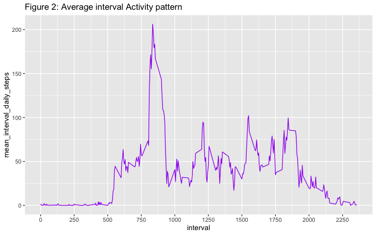

# Activity Monitoring -- Analysis using R

It is now possible to collect a large amount of data about personal movement using activity monitoring devices such as a Fitbit, Nike Fuelband, or Jawbone Up. 

These types of devices are part of the "quantified self" movement -- a group of enthusiasts who take measurements about themselves regularly to improve their health, to find patterns in their behavior, or because they are tech geeks. But these data remain under-utilized both because the raw data are hard to obtain and there is a lack of statistical methods and software for processing and interpreting the data.

The data are known to have the following characteristics:

* one anonymous individual is covered
* collected at 5 minute intervals through out the day
* collected during the months of October and November, 2012
* includes the number of steps taken in 5 minute intervals each day -- this is the activity level

The purpose of this analysis is to assemble the analysis data, and report on key features observed.

## Required R Packages, processing system details 

The `tidyverse` package will suit this analysis (dplyr and ggplot2 specifically).  This work was developed on the following system:

      Model Name: iMac
      Processor Name: Quad-Core Intel Core i7
      Memory: 32 GB


```r
library(tidyverse)
```

```
── Attaching packages ───────────────────────────────────────────────────────────────────────────────────── tidyverse 1.3.0 ──
```

```
✓ ggplot2 3.3.2     ✓ purrr   0.3.4
✓ tibble  3.0.3     ✓ dplyr   1.0.1
✓ tidyr   1.1.1     ✓ stringr 1.4.0
✓ readr   1.3.1     ✓ forcats 0.5.0
```

```
── Conflicts ──────────────────────────────────────────────────────────────────────────────────────── tidyverse_conflicts() ──
x dplyr::filter() masks stats::filter()
x dplyr::lag()    masks stats::lag()
```

## Loading and preprocessing the data -- raw_data_in

The main raw zipped dataset was obtained on Monday, August 24, 2020 at 06:05 AM, from a clone of the [RepData_PeerAssessment1](https://github.com/rdpeng/RepData_PeerAssessment1) github repository.  There were no warnings or issues during the read.


```r
ifelse(file.exists("activity.csv")==TRUE, 
       "activity.csv available",
       unzip("activity.zip", junkpaths=TRUE, exdir = "."))
```

```
[1] "activity.csv available"
```

```r
raw_data_in <- read.csv("activity.csv")
head(raw_data_in)
```

```
  steps       date interval
1    NA 2012-10-01        0
2    NA 2012-10-01        5
3    NA 2012-10-01       10
4    NA 2012-10-01       15
5    NA 2012-10-01       20
6    NA 2012-10-01       25
```

## Data checks -- raw_data_in

Here are some simple checks to see what the raw read data looks like...

1. We confirm the expected data record counts (n=17,568)

```r
nrow(raw_data_in)
```

```
[1] 17568
```

2. Summary of **steps** variable -- this is the measure of activity


```r
summary(raw_data_in$steps)
```

```
   Min. 1st Qu.  Median    Mean 3rd Qu.    Max.    NA's 
   0.00    0.00    0.00   37.38   12.00  806.00    2304 
```

3. Summary of **interval** variable, these are actually time of day values with the last two bytes being the minutes, the preceding bytes the hour.  Stability check -- for any date (24 hour period) we should and do see 288 records, if a day has more or less, there are incomplete sets of data -- these will be caught if present by the distinct.

	288 records --> (288 intervals x 5 minutes per interval = 1440 minutes, 1440 minutes / 60 = 24 hours per day)  
	
	Also, all intervals themselves look good.  The min and max look good, and each interval holds the same number of days (n=61).  This reconciles with our timeframe.


```r
#summary(raw_data_in$interval)
raw_data_in%>%summarise(min_interval=min(interval), max_interval=max(interval), na_interval=sum(is.na(interval)))

raw_data_in%>%arrange(date, interval)%>%group_by(date)%>%
	summarize(distinct_intervals_per_day=n())%>%distinct(distinct_intervals_per_day)
```

```
`summarise()` ungrouping output (override with `.groups` argument)
```

```r
raw_data_in%>%arrange(interval, date)%>%group_by(interval)%>%
	summarize(distinct_days_per_interval=n())%>%distinct(distinct_days_per_interval)
```

```
`summarise()` ungrouping output (override with `.groups` argument)
```

```
  min_interval max_interval na_interval
1            0         2355           0
# A tibble: 1 x 1
  distinct_intervals_per_day
                       <int>
1                        288
# A tibble: 1 x 1
  distinct_days_per_interval
                       <int>
1                         61
```

4. A look at the number of days in our data...


```r
count(distinct(raw_data_in,date))
```

```
   n
1 61
```

Therefore the data initially looks good.  Next, some useful variables will be added to help with the review.

## Creating the main data frame -- activity_data

Next the main data frame will be built.  Below is a list of variables created in this step (to be used later).

new variable|description
------------|-------------
**newdate**|This is the raw character date in Date format
**char_interval**|(dropped) Used to separate Hour and Minutes
**char_interval_length**|(dropped) Used to decide substring particulars
**newdatetime1**|(dropped) Used to isolate pretty time
**interval_tod**|pretty interval TOD, eases research as you can easily see what TOD activity occurs
**weekday**|day of week
**weekend_flag**|flag denoting day of week is during week or weekend
**month**|month

Below is the code to create these...the **date** variable in the raw_data_in is character, therefore some functions are used to build a real date.  Time of day is also added, as it is easily picked up from the interval field.  Finally, since there are likely days when a subject would be more or less active, the weekday and a flag for weekend_day are created.


```r
activity_data <- raw_data_in %>%
	mutate(
		newdate = as.Date(date),
		char_interval = as.character(interval),
		char_interval_length = str_length(char_interval),
		newdatetime1 = ISOdatetime(
			as.numeric(word(date, 1, sep = "-")),
			as.numeric(word(date, 2, sep = "-")),
			as.numeric(word(date, 3, sep = "-")),
			as.numeric(ifelse(
				char_interval_length == 4,
				substr(char_interval, 1, 2),
				ifelse(char_interval_length == 3, substr(char_interval, 1, 1), "0"))),
			as.numeric(ifelse(
				char_interval_length == 4,
				substr(char_interval, 3, 4),
				ifelse(char_interval_length == 3, substr(char_interval, 2, 3), 
				       ifelse(char_interval_length == 2, substr(char_interval,1,2), str_c("0",char_interval))))),
			0),
		interval_tod = strftime(newdatetime1, format = "%I:%M %p"),
		weekday = weekdays.Date(newdate),
		weekend_flag = ifelse(weekday %in% c("Saturday", "Sunday"), "weekend", "weekday"),
		month=str_c(word(date,2,sep="-"), ": ", months(newdate))
	) %>%
	select(-char_interval:-newdatetime1)
```


## What is the mean total number of steps taken per day?

With the analysis dataset built, we can look at our data.  **Figure 1** shows activity level for each day.  We note the existence of 2,304 NAs for the steps variable (reported a la ggplot2).  The mean across all days is captured and plotted for reference.


```r
#--# histogram of the total number of steps taken each day
mean_for_hline <- activity_data %>% group_by(newdate) %>% 
	summarise(tot_per_day=sum(steps, na.rm = TRUE)) %>%
	ungroup %>% summarise(mean_all_days=mean(tot_per_day))
```

```
`summarise()` ungrouping output (override with `.groups` argument)
```

```r
ggplot(data = activity_data) +
	geom_col(mapping = aes(x=newdate, y=steps), fill="blue") +
	geom_hline(yintercept=mean_for_hline$mean_all_days, color="black", linetype=3) +
#	geom_histogram(mapping = aes(x=steps), fill="blue") +
	ggtitle("Figure 1: Total Steps taken per day")
```

```
Warning: Removed 2304 rows containing missing values (position_stack).
```

<!-- -->

The mean and median daily steps, specific details:


```r
#--# report the mean and median total number of steps taken per day
total_steps_stats <- activity_data %>% select(newdate, steps) %>%
	group_by(newdate) %>%
	summarise(total_daily_steps=sum(steps, na.rm = TRUE)) %>%
	ungroup %>% 
		summarize(mean_daily_steps=mean(total_daily_steps, na.rm = TRUE),
			  median_daily_steps=median(total_daily_steps, na.rm = TRUE))
```

```
`summarise()` ungrouping output (override with `.groups` argument)
```

mean_daily_steps|median_daily_steps
----------------|------------------
9354.2295082|10395 

## What is the average daily activity pattern?

Here we will examine the patterns in activity by grouping the intervals/steps across days. **Figure 2** shows such activity -- note, the width of the output here is (as expected) 24 hours.


```r
interval_activity <- activity_data %>% 
	select(interval, interval_tod, steps) %>%
	group_by(interval, interval_tod) %>% 
	summarise(mean_interval_daily_steps=mean(steps, na.rm = TRUE)) %>% ungroup
```

```
`summarise()` regrouping output by 'interval' (override with `.groups` argument)
```

```r
#--# time series plot of the 5-minute interval (x-axis) and the average number of steps taken, averaged across all days
ggplot(interval_activity) +
	geom_line(mapping = aes(x=interval, y=mean_interval_daily_steps), color="purple") +
	scale_x_continuous(n.breaks = 12) +
	ggtitle("Figure 2: Average interval Activity pattern")
```

<!-- -->

This tells us the interval with the highest average daily steps is interval 835, averaging over 206 steps (across our timeframe, October, 2012 through November, 2012).  The time associated with the highest average activity corresponds to 8:35am, perhaps this individual exercises at this time -- this might be useful to confirm with the subject at some point.


```r
#--# maximum number of steps
interval_stats <- interval_activity %>% 
	select(interval, interval_tod, mean_interval_daily_steps) %>% 
	filter(mean_interval_daily_steps==max(interval_activity$mean_interval_daily_steps))
```

interval_tod|mean_interval_daily_steps
------------|------
08:35 AM|206.1698113 

## Imputing missing values -- activity_data2

As we noted above, when we plot the steps, we encounter NAs for over 2,300 records.  Here we will examine the NA mix with respect to the dates, and also see what it looks like when we have zeroes for steps.

To plug our data, we will calculate the imputed values based on the following key:

key level|reason
---------|------
**weekend_flag**|this may help add precision by addressing distinctively weekend activities
**interval**|more precision -- different periods of the day may experience patterns of higher/lower activity
**interval_tod**|same level as interval (interval and interval_tod are the same)

Looking at the plugs, by plugging at the weekend_flag level the more active weekend values would be a more precise approach, as opposed to using a broader plug values like mean per day.  Below is output looking at first weekend_flag/interval level plugging, followed by a version at the weekday/interval level.


```r
interval_activity_plugs <- activity_data %>% 
	# select(month, weekend_flag, interval, interval_tod, steps) %>%
	# group_by(month, weekend_flag, interval, interval_tod) %>% 
	select(weekend_flag, interval, interval_tod, steps) %>%
	group_by(weekend_flag, interval, interval_tod) %>% 
	summarise(mean_interval_daily_steps=mean(steps, na.rm = TRUE)) %>% ungroup
```

```
`summarise()` regrouping output by 'weekend_flag', 'interval' (override with `.groups` argument)
```

```r
#head(interval_activity_plugs)

interval_activity_plugs %>%
	# select(month, weekend_flag, mean_interval_daily_steps) %>%
	# group_by(month, weekend_flag) %>%
	select(weekend_flag, mean_interval_daily_steps) %>%
	group_by(weekend_flag) %>%
	summarise(mean_interval_daily_steps_weekend_flag=mean(mean_interval_daily_steps))
```

```
`summarise()` ungrouping output (override with `.groups` argument)
```

```
# A tibble: 2 x 2
  weekend_flag mean_interval_daily_steps_weekend_flag
  <chr>                                         <dbl>
1 weekday                                        35.3
2 weekend                                        43.1
```

Here is a second look at the plugs...by plugging at the weekday level the more active weekend values are more precise (as opposed to a more general approach).  With Wednesday looking like a weekend day (much larger than the other weekdays), I believe this should lend a more accurate solution than just separating the weekend_flag.


```r
interval_activity_plugs <- activity_data %>% 
	# select(month, weekend_flag, interval, interval_tod, steps) %>%
	# group_by(month, weekend_flag, interval, interval_tod) %>% 
	select(weekday, interval, interval_tod, steps) %>%
	group_by(weekday, interval, interval_tod) %>% 
	summarise(mean_interval_daily_steps=mean(steps, na.rm = TRUE)) %>% ungroup
```

```
`summarise()` regrouping output by 'weekday', 'interval' (override with `.groups` argument)
```

```r
#str(interval_activity_plugs)

interval_activity_plugs %>%
	# select(month, weekend_flag, mean_interval_daily_steps) %>%
	# group_by(month, weekend_flag) %>%
	select(weekday, mean_interval_daily_steps) %>%
	group_by(weekday) %>%
	summarise(mean_interval_daily_steps_weekday=mean(mean_interval_daily_steps))
```

```
`summarise()` ungrouping output (override with `.groups` argument)
```

```
# A tibble: 7 x 2
  weekday   mean_interval_daily_steps_weekday
  <chr>                                 <dbl>
1 Friday                                 42.9
2 Monday                                 34.6
3 Saturday                               43.5
4 Sunday                                 42.6
5 Thursday                               28.5
6 Tuesday                                31.1
7 Wednesday                              40.9
```

Now for the imputations...First, two new variables are created, **newsteps** will be the original value for steps normally, but for NA records will inner_join on the average activity per interval (created above, interval_activity data frame). A variable **imputed_flag** is created to more easily see what is plugged.  The number of rows coming in and exiting the process are confirmed to be equal.


```r
activity_data2 <- activity_data %>% 
	inner_join(interval_activity_plugs, by = c("weekday", "interval", "interval_tod"))  %>%
	mutate(newsteps=ifelse(is.na(steps)==TRUE, mean_interval_daily_steps, steps),
	       imputed_flag=ifelse(is.na(steps)==TRUE, "imputed (mean for interval)", "untouched")) %>%
	arrange(newdate, interval)
nrow(activity_data2)==nrow(activity_data)
head(activity_data2)
```

```
[1] TRUE
  steps       date interval    newdate interval_tod weekday weekend_flag
1    NA 2012-10-01        0 2012-10-01     12:00 AM  Monday      weekday
2    NA 2012-10-01        5 2012-10-01     12:05 AM  Monday      weekday
3    NA 2012-10-01       10 2012-10-01     12:10 AM  Monday      weekday
4    NA 2012-10-01       15 2012-10-01     12:15 AM  Monday      weekday
5    NA 2012-10-01       20 2012-10-01     12:20 AM  Monday      weekday
6    NA 2012-10-01       25 2012-10-01     12:25 AM  Monday      weekday
        month mean_interval_daily_steps newsteps                imputed_flag
1 10: October                  1.428571 1.428571 imputed (mean for interval)
2 10: October                  0.000000 0.000000 imputed (mean for interval)
3 10: October                  0.000000 0.000000 imputed (mean for interval)
4 10: October                  0.000000 0.000000 imputed (mean for interval)
5 10: October                  0.000000 0.000000 imputed (mean for interval)
6 10: October                  5.000000 5.000000 imputed (mean for interval)
```

Here is the count of missings from the original data, as expected there are n=2,304.


```r
#--# report the total number of missing values in the dataset
count(activity_data, is.na(steps))
```

```
  is.na(steps)     n
1        FALSE 15264
2         TRUE  2304
```

Now the plugged steps variable (newsteps) will be plotted to see how things look. **Figure 3** shows us a picture of newsteps, the data we imputed/plugged.  You can see that any plugging occurred all or nothing, in the raw data either all were NA in a day, or none.


```r
#--# histogram of the total number of steps taken each day
ggplot(data = activity_data2) +
	geom_col(mapping = aes(x=newdate, y=newsteps, fill=imputed_flag)) +
#	geom_histogram(stat="identity", mapping = aes(y=newsteps, x=newdate, fill=imputed_flag)) +
	ggtitle("Figure 3: Average interval activty distribution, NAs replaced with interval means")
```

<!-- -->

This shows the change in mean/median due to our imputation process.  The mean rises by 15%.


```r
#--# report the mean and median total number of steps taken per day, using replica data with plugs
temp <- activity_data2 %>% 
	select(newdate, steps, newsteps) %>%
	group_by(newdate) %>%
		summarise(total_daily_steps=sum(steps, na.rm = TRUE),
			  total_daily_newsteps=sum(newsteps, na.rm = TRUE)) %>%
	ungroup %>%
	summarise(mean_daily_steps=mean(total_daily_steps, na.rm = TRUE),
		  med_daily_steps=median(total_daily_steps, na.rm = TRUE),
		  mean_daily_newsteps=mean(total_daily_newsteps, na.rm = TRUE),
		  med_daily_newsteps=median(total_daily_newsteps, na.rm = TRUE)) %>%
	mutate(pct_increase_mean=(mean_daily_newsteps-mean_daily_steps)/mean_daily_steps,
	       pct_increase_med=(med_daily_newsteps-med_daily_steps)/med_daily_steps)
```

```
`summarise()` ungrouping output (override with `.groups` argument)
```

```r
temp %>% select(mean_daily_steps, med_daily_steps)
temp %>% select(mean_daily_newsteps, med_daily_newsteps)
temp %>% select(pct_increase_mean)
```

```
# A tibble: 1 x 2
  mean_daily_steps med_daily_steps
             <dbl>           <int>
1            9354.           10395
# A tibble: 1 x 2
  mean_daily_newsteps med_daily_newsteps
                <dbl>              <dbl>
1              10821.              11015
# A tibble: 1 x 1
  pct_increase_mean
              <dbl>
1             0.157
```

# Are there differences in activity patterns between weekdays and weekends?

Differences in activity levels can be observed for this subject (recall this is one person's data, October/November).  Looking at **Figure 4**, one notices more early morning activity during the week.  Weekends look as if the subject is less active in the morning, but once the day unfolds activity levels increase above weekday levels and maintain.


```r
#--# panel plot containing a time series plot
for_panel_plot <- activity_data2 %>%
	select(weekend_flag, interval, newsteps) %>%
	group_by(weekend_flag, interval) %>%
	summarise(mean_newsteps=mean(newsteps))
```

```
`summarise()` regrouping output by 'weekend_flag' (override with `.groups` argument)
```

```r
ggplot(for_panel_plot) +
	geom_line(mapping = aes(x=interval, y=mean_newsteps, color=weekend_flag)) +
	geom_smooth(mapping = aes(x=interval, y=mean_newsteps, color=weekend_flag), se=FALSE) +
	scale_x_continuous(n.breaks = 12) +
#	scale_x_continuous(breaks = c(500:2100, 100)) +
	facet_wrap(~weekend_flag, nrow=2, ncol=1) +
 	ggtitle("Figure 4: Comparing weekday days to Weekend days, NAs plugged")
```

```
`geom_smooth()` using method = 'loess' and formula 'y ~ x'
```

<!-- -->

# Conclusion

This was an in depth look at some simple data describing fall physical activity for an individual.  There were few data issues outside of missing data for the measurement.  By plugging these missing values, the data shifted 15%, which is not small.  Also, a review of some odd, zero value steps data leads one to ask what this might be.  In other words, what is the difference between 0 and NA?  Zero value data may indicate a device left on a table undisturbed, while an NA may indicated the device was off.  

How might these data be used?  One real opportunity would be to use the data to identify opportunities to change up the subject's schedule in order to achieve more activity.  
